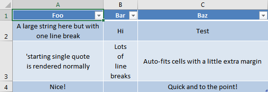

# @papb/json-excel [](https://github.com/papb/json-excel/actions/workflows/ci.yml)

> Create a pretty Excel table from JSON data with a very simple API. Supports Node.js and browsers.


## Highlights

* Pretty output
* Intelligently auto-fits cell sizes by default
* Checks for [Excel limitations](https://support.microsoft.com/en-ie/office/excel-specifications-and-limits-1672b34d-7043-467e-8e27-269d656771c3) automatically (such as maximum cell length) and throws helpful errors if any limit is exceeded
* Get the *Format as Table* Excel styling, with filterable headers, by simply enabling an option
* Written in TypeScript (you get autocomplete suggestions in your IDE!)
* Works in Node.js and browsers


## Install

### Node.js

```
$ npm install @papb/json-excel
```

### Browsers

```html
<script src="https://cdn.jsdelivr.net/npm/@papb/json-excel@2.0.0/dist/browser/json-excel.min.js">
```

## Importing

### Node.js

```js
import { jsonToExcel, exportJsonToExcel } from '@papb/json-excel';        // ESM / TypeScript syntax
const { jsonToExcel, exportJsonToExcel } = require('@papb/json-excel');   // CommonJS syntax
```

### Browsers

```js
const { jsonToExcel, exportJsonToExcel } = window.jsonToExcel;
```

## Usage

```js
await exportJsonToExcel(
	'example.xlsx',
	[
		{
			sheetName: 'Hello World',
			data: [
				['Foo', 'Bar', 'Baz'],
				['A large string here but with\none line break', 'Hi', 'Test'],
				[
					'\'starting single quote\nis rendered normally',
					'Lots\nof\nline\nbreaks',
					'Auto-fits cells with a little extra margin'
				],
				['Nice!', '', 'Quick and to the point!']
			],
			formatAsTable: true
		}
	],
	{
		overwrite: true // Only for Node.js usage
	}
);
```

Output is an excel file called `example.xlsx` with a single sheet (called `Hello World`) and the following content:




## API

<!-- Ensure this part is consistent with ./types.ts and ./defaults.ts -->

### jsonToExcel(destinationNameOrPath, jsonSheets, options?)

_Note:_ you probably want to use the `exportJsonToExcel` function directly instead.

Async function that creates an [ExcelJS.Workbook](https://github.com/exceljs/exceljs) object from the provided data.

#### jsonSheets

Type: `object[]`

An array of objects, each representing one sheet, with:

* `sheetName` (`string`, required): The name of the Worksheet (shown in the sheet tab in the bottom in Excel).
* `data` (`string[][]`, required): The data to be populated in the Worksheet.
* `formatAsTable` (`boolean`, optional, default `false`): Whether or not to enable the *"Format as Table"* styling, like in the above example. This will enable striped rows and filter arrows on all headers.
* `tableTheme` (`string`, optional, default `'TableStyleMedium9'`): Which theme to use when formatting as table. This option is ignored if `formatAsTable` is `false`. The default value corresponds to the one from the screenshot above (medium blue). The list of supported themes is shown right in your IDE via autocomplete suggestions to this option. The autocomplete works even if you are not using TypeScript!
* `autoTrimWhitespace` (`boolean`, optional, default `true`): Whether or not to automatically remove leading and trailing whitespace from each cell. Having this enabled is great to make the cell content alignment be consistent with what is visible.
* `autoFitCellSizes` (`boolean`, optional, default `true`): Whether or not to automatically calculate best widths for every column and best heights for every row.
* `autoFitCellSizesOptions` (`object`, optional): Extra options for configuring the behavior of the auto-fitting of cell sizes:
	* `minHeight` (`number`, optional, default `15`): The minimum height (in *"excel points"*) for every row.
	* `maxHeight` (`number`, optional, default `408`): The maximum height (in *"excel points"*) for every row. Cannot be greater than 408 (this is an Excel limitation).
	* `minWidth` (`number`, optional, default `6`): The minimum width (in *"excel points"*) for every column.
	* `maxWidth` (`number`, optional, default `170`): The maximum width (in *"excel points"*) for every column. Cannot be greater than 254 (this is an Excel limitation).
	* `horizontalPadding` (`number`, optional, default `3`): Extra horizontal padding (in *"excel points"*) for every column. This amount will be added to the auto-calculated minimal width in which the contents fit.
	* `verticalPadding` (`number`, optional, default `2`): Extra vertical padding (in *"excel points"*) for every cell. This amount will be added to the auto-calculated minimal height in which the contents fit.

#### options

Type: `object`

##### normalizeLinefeeds

Type: `boolean`\
Default: `true`

Whether or not to automatically convert [CRLF](https://en.wikipedia.org/wiki/Newline) in strings given in sheets `data` to LF.

##### linefeedLimitChecking

Type: `string`\
Possible values: `'legacy', '>=2020', 'off'`\
Default: `'legacy'`

Excel has a strange limitation on the amount of lines a cell can display. After a certain number of lines, Excel will stop rendering them, but they will still be there (if copied and pasted in a text editor, for example). This option specifies how `@papb/json-excel` will protect you from this.

The exact amount of lines before this display glitch happens depends on the Excel version. In the latest version (2020), lines from the 1639th onwards will not be rendered. Until 2017, this happens from the 255th line onwards (as reported [here](https://answers.microsoft.com/en-us/msoffice/forum/all/excel-does-not-display-the-line-feed-character/95201f69-670b-414f-91fc-3a3b1690ff96)). The exact limit for versions between 2017 and 2020 is not known.

This way:

* If you choose `'legacy'`: the maximum amount of linefeeds allowed will be `253`. An error will be thrown if any cell has `254` or more linefeeds.
* If you choose `'>=2020'`: the maximum amount of linefeeds allowed will be `1637`. An error will be thrown if any cell has `1638` or more linefeeds.
* If you choose `'off'`: this limit will not be checked. Recall that lines beyond the limit are not lost - they are simply not rendered by Excel, but copying and pasting into a text editor will retrieve all data, without loss.

### exportJsonToExcel(destinationNameOrPath, jsonSheets, options?)

Async function that creates a xlsx file from the provided data.

* In Node.js: resolves when the xlsx file *finishes* being written to the filesystem.

* In browswer: resolves when the xlsx file *begins* to be downloaded. This is due to an issue with [FileSaver.js](https://github.com/eligrey/FileSaver.js/issues/699).

#### destinationNameOrPath

Type: `string`

* In Node.js: the path (absolute, or relative to `process.cwd()`) in which the new xlsx file should be created. In windows, both `/` and `\` are accepted as path separators.

* In browsers: the name of the file to be generated and downloaded to the client.

#### jsonSheets

Same as in `jsonToExcel` above.

#### options

Type: `object`

##### normalizeLinefeeds

Same as in `jsonToExcel` above.

##### linefeedLimitChecking

Same as in `jsonToExcel` above.

##### beforeSave

Type: `(workbook: ExcelJS.Workbook) => void | Promise<void>`\
Default: do nothing

A custom operation to be performed on the resulting [ExcelJS](https://github.com/exceljs/exceljs) workbook, right before generating the output file.

You can use this hook to make arbitrary custom changes in the generated workbook.

If you return a Promise from this hook, it will be awaited.

Example:

```js
await jsonToExcel(
	sheets,
	'example.xlsx',
	{
		overwrite: true,
		beforeSave(workbook) {
			workbook.creator = 'Someone';
			workbook.lastModifiedBy = 'Someone Else';
			workbook.getWorksheet(1).getCell('C3').font = {
				bold: true
			};
		}
	}
);
```

See the [ExcelJS](https://github.com/exceljs/exceljs) documentation for details on what you can do with the workbook.

##### overwrite

Type: `boolean`\
Default: `false`

Whether or not to overwrite the destination file if it already exists.

This option is for Node.js only, and is ignored in browsers.


## Tip: usage with `object[]` instead of `string[][]`

If, instead of directly tabular data, you have a list of objects such as...

```js
const data = [
	{ name: 'Grape', size: 'small' },
	{ name: 'Watermelon', size: 'big' },
	{ name: 'Apple', size: 'medium' }
];
```

...you can use `jsonToExcel` by simply converting that to a `string[][]` first, with a simple loop (or array `.map` call). Example:

```js
const headers = ['Name', 'Size'];
const dataAs2DArray = data.map(fruit => [fruit.name, fruit.size]);

await exportJsonToExcel(
	'fruits.xlsx',
	[
		{
			sheetName: 'Fruits',
			data: [
				headers,
				...dataAs2DArray
			],
			formatAsTable: true
		}
	]
);
```


## License

MIT © [Pedro Augusto de Paula Barbosa](https://github.com/papb)
